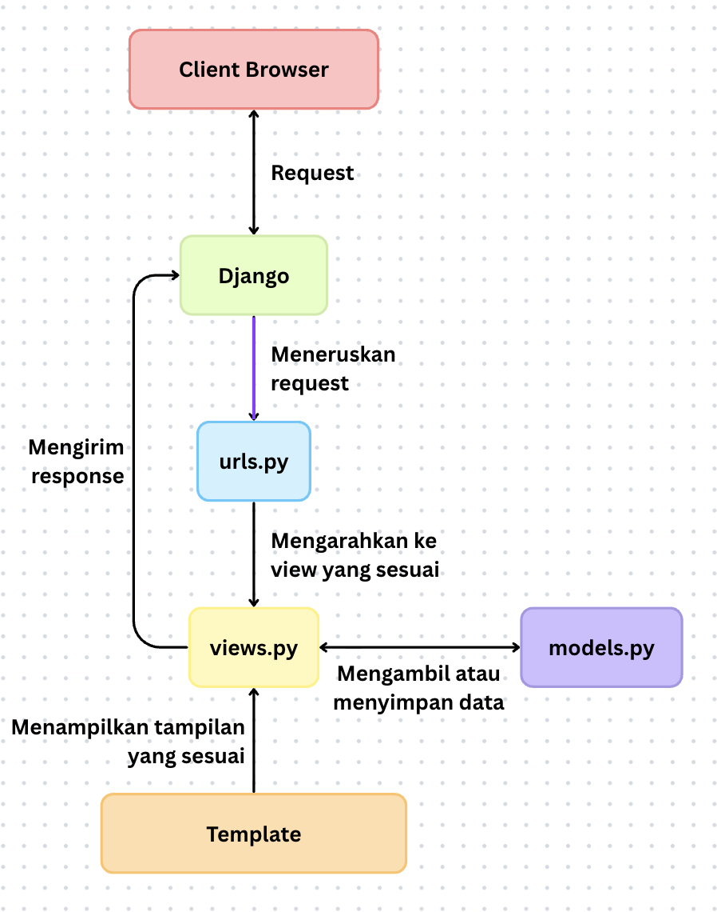

# Football Shop - Django Project

## Link Aplikasi
(https://your-pws-link.cs.ui.ac.id)

## Implementasi Checklist Step-by-Step

1. **Membuat Proyek Django Baru**  
   - Menjalankan `django-admin startproject football_shop` untuk membuat proyek utama.

2. **Membuat Aplikasi `main`**  
   - Menjalankan `python manage.py startapp main` untuk membuat aplikasi dalam proyek.

3. **Routing Proyek**  
   - Menambahkan `path('', include('main.urls'))` di `football_shop/urls.py`.
   - Membuat `main/urls.py` dengan path root yang mengarah ke `show_main`.

4. **Membuat Model `Product`**  
   - Membuat model `Product` dengan atribut wajib:  
     `name` (CharField), `price` (IntegerField), `description` (TextField),  
     `thumbnail` (URLField), `category` (CharField), `is_featured` (BooleanField).

5. **Membuat View `show_main`**  
   - Mengambil semua produk dari database (`Product.objects.all()`) dan mengirim context berisi data diri dan produk ke template `main.html`.

6. **Membuat Template HTML (`main.html`)**  
   - Menampilkan nama aplikasi, nama dan kelas, serta daftar featured products.

7. **Testing**  
   - Membuat `tests.py` untuk memastikan URL, template, dan model bekerja.

8. **Deployment ke PWS**  
   - Mengikuti panduan deployment PWS untuk menjalankan aplikasi agar bisa diakses secara publik.

---

## Bagan Request & Response

---

## Peran settings.py dalam Proyek Django
Berkas `settings.py` berfungsi sebagai pusat konfigurasi proyek Django.  
Semua pengaturan utama didefinisikan di sini, seperti:  
- **INSTALLED_APPS** → daftar aplikasi yang digunakan dalam proyek.  
- **DATABASES** → konfigurasi database (misalnya SQLite, PostgreSQL, MySQL).  
- **MIDDLEWARE** → komponen yang memproses request dan response.  
- **TEMPLATES** → lokasi dan pengaturan template HTML.  
- **STATIC & MEDIA FILES** → pengaturan file statis (CSS, JS, gambar).  
- **DEBUG & ALLOWED_HOSTS** → mengatur mode debugging dan domain yang diizinkan.  

---

## Cara Kerja Migrasi Database di Django
Migrasi database di Django adalah proses untuk menyinkronkan perubahan pada **model (models.py)** dengan **struktur database**.  

Cara kerjanya:  
1. **Membuat file migrasi**  
   - Saat menjalankan `python manage.py makemigrations`, Django membaca perubahan di `models.py` dan membuat file migrasi (di folder `migrations/`) yang berisi instruksi SQL.  

2. **Menerapkan migrasi ke database**  
   - Dengan `python manage.py migrate`, Django mengeksekusi file migrasi tersebut ke database sehingga struktur tabel sesuai dengan definisi di model.  

3. **Tracking migrasi**  
   - Django menyimpan catatan migrasi yang sudah dijalankan di tabel khusus (`django_migrations`) agar tidak dijalankan ulang.  

---

## Mengapa Django Dijadikan Permulaan Pembelajaran Pengembangan Perangkat Lunak?
Django dipilih sebagai framework awal dalam pembelajaran karena beberapa alasan:  

1. **Konsep MVC/MVT yang jelas**  
   Django menggunakan arsitektur *Model-View-Template* yang memisahkan logika bisnis, data, dan tampilan. Hal ini membantu untuk memahami bagaimana sebuah aplikasi web bekerja secara terstruktur.  

2. **Banyak fitur bawaan**  
   Django sudah menyediakan ORM, sistem autentikasi, admin panel, form handling, hingga keamanan dasar. Dengan begitu, bisa langsung fokus pada konsep inti tanpa harus membangun semuanya dari nol.  

3. **Mengajarkan praktik terbaik**  
   Django mendorong penggunaan pola desain yang rapi, DRY (*Don’t Repeat Yourself*), serta manajemen proyek yang terorganisir sehingga terbiasa menulis kode yang bersih dan terstruktur.  

4. **Relevan dengan industri**  
   Django digunakan di banyak perusahaan dan startup, dengan harapan apa yang dipelajari di PBP bisa berguna untuk dunia kerja nantinya.  

---

## Feedback untuk Asisten Dosen Tutorial 1
Sejauh ini belum ada ^^