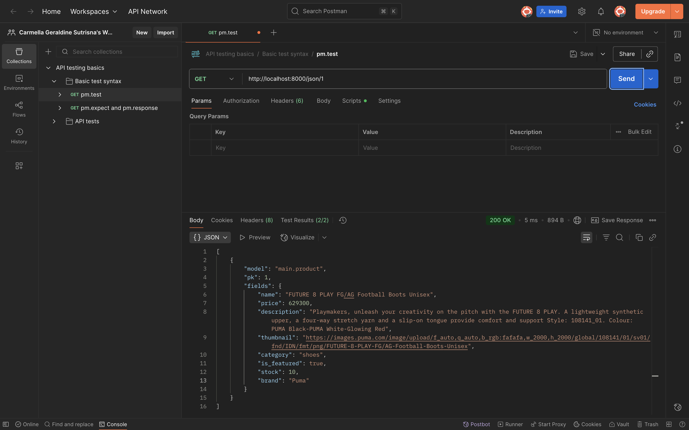

Tugas 2

## Link Aplikasi
(https://carmella-geraldine-footballshop.pbp.cs.ui.ac.id)

## 1. Jelaskan bagaimana cara kamu mengimplementasikan checklist di atas secara step-by-step (bukan hanya sekadar mengikuti tutorial).

1. **Membuat Proyek Django Baru**  
   - Menjalankan `django-admin startproject football_shop` untuk membuat proyek utama.

2. **Membuat Aplikasi `main`**  
   - Menjalankan `python manage.py startapp main` untuk membuat aplikasi dalam proyek.

3. **Routing Proyek**  
   - Menambahkan `path('', include('main.urls'))` di `football_shop/urls.py`.
   - Membuat `main/urls.py` dengan path root yang mengarah ke `show_main`.

4. **Membuat Model `Product`**  
   - Membuat model `Product` dengan atribut wajib:  
     `name` (CharField), `price` (IntegerField), `description` (TextField),  
     `thumbnail` (URLField), `category` (CharField), `is_featured` (BooleanField).

5. **Membuat View `show_main`**  
   - Mengambil semua produk dari database (`Product.objects.all()`) dan mengirim context berisi data diri dan produk ke template `main.html`.

6. **Membuat Template HTML (`main.html`)**  
   - Menampilkan nama aplikasi, nama dan kelas, serta daftar featured products.

7. **Testing**  
   - Membuat `tests.py` untuk memastikan URL, template, dan model bekerja.

8. **Deployment ke PWS**  
   - Mengikuti panduan deployment PWS untuk menjalankan aplikasi agar bisa diakses secara publik.

---

## 2. Buatlah bagan yang berisi request client ke web aplikasi berbasis Django beserta responnya dan jelaskan pada bagan tersebut kaitan antara urls.py, views.py, models.py, dan berkas HTML.

---

## 3. Jelaskan peran settings.py dalam Proyek Django
Berkas `settings.py` berfungsi sebagai pusat konfigurasi proyek Django.  
Semua pengaturan utama didefinisikan di sini, seperti:  
- **INSTALLED_APPS** → daftar aplikasi yang digunakan dalam proyek.  
- **DATABASES** → konfigurasi database (misalnya SQLite, PostgreSQL, MySQL).  
- **MIDDLEWARE** → komponen yang memproses request dan response.  
- **TEMPLATES** → lokasi dan pengaturan template HTML.  
- **STATIC & MEDIA FILES** → pengaturan file statis (CSS, JS, gambar).  
- **DEBUG & ALLOWED_HOSTS** → mengatur mode debugging dan domain yang diizinkan.  

---

## 4. Bagaimana cara kerja migrasi database di Django?
Migrasi database di Django adalah proses untuk menyinkronkan perubahan pada **model (models.py)** dengan **struktur database**.  

Cara kerjanya:  
1. **Membuat file migrasi**  
   - Saat menjalankan `python manage.py makemigrations`, Django membaca perubahan di `models.py` dan membuat file migrasi (di folder `migrations/`) yang berisi instruksi SQL.  

2. **Menerapkan migrasi ke database**  
   - Dengan `python manage.py migrate`, Django mengeksekusi file migrasi tersebut ke database sehingga struktur tabel sesuai dengan definisi di model.  

3. **Tracking migrasi**  
   - Django menyimpan catatan migrasi yang sudah dijalankan di tabel khusus (`django_migrations`) agar tidak dijalankan ulang.  

---

## 5. Menurut Anda, dari semua framework yang ada, mengapa framework Django dijadikan permulaan pembelajaran pengembangan perangkat lunak?
Django dipilih sebagai framework awal dalam pembelajaran karena beberapa alasan:  

1. **Konsep MVC/MVT yang jelas**  
   Django menggunakan arsitektur *Model-View-Template* yang memisahkan logika bisnis, data, dan tampilan. Hal ini membantu untuk memahami bagaimana sebuah aplikasi web bekerja secara terstruktur.  

2. **Banyak fitur bawaan**  
   Django sudah menyediakan ORM, sistem autentikasi, admin panel, form handling, hingga keamanan dasar. Dengan begitu, bisa langsung fokus pada konsep inti tanpa harus membangun semuanya dari nol.  

3. **Mengajarkan praktik terbaik**  
   Django mendorong penggunaan pola desain yang rapi, DRY (*Don’t Repeat Yourself*), serta manajemen proyek yang terorganisir sehingga terbiasa menulis kode yang bersih dan terstruktur.  

4. **Relevan dengan industri**  
   Django digunakan di banyak perusahaan dan startup, dengan harapan apa yang dipelajari di PBP bisa berguna untuk dunia kerja nantinya.  

---

## 6. Apakah ada feedback untuk asisten dosen tutorial 1 yang telah kamu kerjakan sebelumnya?
Sejauh ini belum ada ^^

Tugas 3

## 1. Jelaskan mengapa kita memerlukan data delivery dalam pengimplementasian sebuah platform?
Data delivery adalah proses pengiriman data dari satu pihak ke pihak lain dalam sebuah platform, baik antar komponen internal maupun eksternal. Alasan kenapa data delivery itu penting:

1. **Menghubungkan antar komponen sistem**
   Platform biasanya terdiri dari berbagai bagian. Tanpa mekanisme pengiriman data, tiap bagian ini tidak bisa saling bertukar informasi.
   
2. **Memberikan informasi yang up-to-date ke pengguna**
   Misalnya di e-commerce, data stok barang atau harga harus dikirim secara real-time agar pengguna melihat informasi terbaru.
   
3. **Mendukung interaktivitas aplikasi**
   Fitur seperti login, pencarian, transaksi, atau notifikasi hanya bisa berjalan kalau ada alur request-response data yang jelas.

4. **Menjamin konsistensi data**
   Data delivery memastikan data yang ada di server sinkron dengan yang ditampilkan di client, sehingga tidak terjadi perbedaan informasi.

5. **Membuka integrasi dengan layanan lain**
   Platform modern sering butuh komunikasi dengan layanan eksternal. Semua ini hanya bisa jalan lewat data delivery.

---

## 2. Menurutmu, mana yang lebih baik antara XML dan JSON? Mengapa JSON lebih populer dibandingkan XML?
1. **Mana yang lebih baik antara XML dan JSON?**
   Tergantung kebutuhan. XML lebih cocok untuk data kompleks dengan hierarki, metadata, dan validasi ketat, sedangkan JSON lebih unggul untuk pertukaran data yang sederhana,    cepat, ringan, dan mudah dibaca, terutama di web dan mobile.

2. **Mengapa JSON lebih populer dibandingkan XML?**
   Beberapa alasan utama kenapa JSON lebih banyak dipakai:
   - **Lebih ringkas dan sederhana**
     JSON hanya pakai kurung kurawal dan array, sedangkan XML butuh banyak tag pembuka & penutup sehingga ukuran file JSON lebih kecil dan menyebabkan lebih cepat untuk dikirim lewat jaringan.
   - **Mudah dipahami dan dibaca**
     Struktur JSON mirip dengan objek di JavaScript, sehingga lebih cepat menggunakannya.
   - **Mudah diproses oleh program**
     Di JavaScript, data JSON bisa langsung dipakai tanpa konversi ribet.
   - **Performa lebih baik untuk API modern**
     API REST dan GraphQL umumnya mengutamakan JSON karena lebih efisien dibanding XML.
   - **Tren industri**
     JSON jadi standar de facto dalam komunikasi client–server.

---

## 3. Jelaskan fungsi dari method is_valid() pada form Django dan mengapa kita membutuhkan method tersebut?
Method is_valid() digunakan untuk memvalidasi data yang dikirimkan melalui form. Saat form menerima input, Django akan memeriksa apakah data tersebut sesuai dengan aturan yang ditentukan di form. Jika semua validasi terpenuhi, is_valid() akan mengembalikan True, dan data bersihnya bisa diakses lewat form.cleaned_data. Kalau ada yang salah, is_valid() mengembalikan False, dan form menyimpan pesan error yang bisa ditampilkan ke user. Kita membutuhkan method tsb. untuk:
- **Menjamin keakuratan data** → hanya data valid yang akan diproses atau disimpan ke database.
- **Meningkatkan keamanan** → mencegah input berbahaya masuk ke sistem.
- **Memberikan feedback ke pengguna** → jika input salah, error bisa langsung ditampilkan di form.
- **Menyederhanakan validasi** → tidak perlu menulis kode validasi manual.

---

## 4. Mengapa kita membutuhkan csrf_token saat membuat form di Django? Apa yang dapat terjadi jika kita tidak menambahkan csrf_token pada form Django? Bagaimana hal tersebut dapat dimanfaatkan oleh penyerang?
1. **Mengapa kita membutuhkan csrf_token saat membuat form di Django?**
   csrf_token (Cross-Site Request Forgery token) adalah token unik yang ditambahkan ke setiap form di Django untuk memastikan bahwa request POST benar-benar berasal dari user yang sah melalui website kita, bukan dari sumber eksternal yang berbahaya. Dengan token ini, server bisa memverifikasi bahwa request datang dari browser user yang sedang login dan bukan dari serangan luar.

2. **Apa yang dapat terjadi jika kita tidak menambahkan csrf_token pada form Django?**
   Tanpa csrf_token, aplikasi jadi rentan terhadap serangan CSRF (Cross-Site Request Forgery). Artinya, penyerang bisa mengirimkan request palsu ke server atas nama user tanpa sepengetahuan user.

3. **Bagaimana hal tersebut dapat dimanfaatkan oleh penyerang?**
   Contoh pemanfaatan:
   1. User sedang login di aplikasi bank berbasis web.
   2. Penyerang membuat halaman berbahaya berisi form tersembunyi yang otomatis mengirimkan request POST ke server bank (misalnya transfer uang).
   3. Karena user masih login, browser akan mengirimkan cookie session valid ke server bank.
   4. Jika tidak ada proteksi csrf_token, server menganggap request itu sah, sehingga transaksi berbahaya bisa terjadi tanpa diketahui user.

---

## 5. Jelaskan bagaimana cara kamu mengimplementasikan checklist di atas secara step-by-step.
1. **Siapkan `ModelForm`**  
   - Buat `main/forms.py`.

2. **Tambahkan 4 view untuk XML / JSON**
   - Menggunakan `django.core.serializers` untuk XML/JSON.

3. **Buat routing URL untuk masing-masing view**
   - Menambahkan path di `main/urls.py`

4. **Buat view untuk list, add (form) dan detail**

5. **Edit `templates/main.html` agar user bisa menambahkan porduct**

---

## 6. Apakah ada feedback untuk asdos di tutorial 2 yang sudah kalian kerjakan?
Sejauh ini belum ada.

---

## Hasil akses keempat URL menggunakan Postman

Tugas 4

## 1. Apa itu Django AuthenticationForm? Jelaskan juga kelebihan dan kekurangannya.

`AuthenticationForm` adalah form bawaan Django (`django.contrib.auth.forms.AuthenticationForm`) yang dipakai untuk proses login. Fungsinya memvalidasi username + password dan memanggil `authenticate()` untuk mengecek kredensial.

**Kelebihan**
1. Siap pakai sehingga tidak perlu menulis validasi credential dari nol.
2. Integrasi langsung dengan `django.contrib.auth` (middleware, backends, session).
3. Sudah menangani pesan error standar (user tidak ada, password salah).
4. Aman selama dipakai bersama CSRF middleware dan HTTPS.

**Kekurangan**
1. Default tampilannya minimal, perlu custom template/CSS untuk UI.
2. Tidak punya fitur “remember me” otomatis — harus ditambahkan sendiri.
3. Kalau pakai custom user model dengan field berbeda, mungkin perlu sedikit penyesuaian.
4. Error message generik — kalo perlu message lebih informatif harus override.

---

## 2. Apa perbedaan antara autentikasi dan otorisasi? Bagaiamana Django mengimplementasikan kedua konsep tersebut?

**Autentikasi** = *"Siapa kamu?”* → proses verifikasi identitas user saat login.
**Otorisasi** = *"Apa yang boleh kamu lakukan?”* → proses menentukan hak akses user setelah berhasil login.

Cara Django mengimplementasikannya:
1. Autentikasi:
   - Fungsi utama: `authenticate()`, `login()`, `logout()`.
   - Akses user di request: `request.user`, `user.is_authenticated`.
   - Middleware penting: `SessionMiddleware` + `AuthenticationMiddleware`.
2. Otorisasi:
   - Sistem permissions dan groups.
   - Cek permission: `user.has_perm('app_label.action_model')`.
   - Decorator: `@permission_required('app_label.action_model')`.
   - Atribut khusus: `is_staff` (akses admin site), `is_superuser` (akses penuh).
   - Group bisa dibuat di Django admin, lalu assign permission ke group → user cukup dimasukkan ke group.

---

## 3. Apa saja kelebihan dan kekurangan session dan cookies dalam konteks menyimpan state di aplikasi web?

**Cookies (client-side storage)**
Kelebihan:
- Simpel, tidak perlu beban di server karena data disimpan di browser user.
- Bisa bertahan antar sesi (misalnya “remember me”).
- Mudah diakses oleh client.

Kekurangan:
- Kapasitas terbatas (umumnya maksimal ±4KB per cookie).
- Data bisa dimodifikasi user (tidak 100% aman).
- Rentan terhadap serangan XSS/CSRF jika tidak diamankan.
- Tidak cocok menyimpan data sensitif.

**Sessions (server-side storage, hanya simpan session ID di cookie)**
Kelebihan:
- Lebih aman karena data sebenarnya disimpan di server, bukan di browser.
- Bisa menyimpan data kompleks dan ukuran lebih besar dibanding cookie.
- User tidak bisa memodifikasi data session secara langsung.

Kekurangan:
- Membutuhkan storage di server (database, file, cache).
- Menambah overhead pada server, terutama kalau banyak user aktif.
- Perlu konfigurasi tambahan untuk sistem skala besar.

---

## 4. Apakah penggunaan cookies aman secara default dalam pengembangan web, atau apakah ada risiko potensial yang harus diwaspadai? Bagaimana Django menangani hal tersebut?

**Cookies belum tentu aman karena bisa dibaca atau diubah oleh user di browser.**

Risiko utama:
- Session hijacking: pencurian session ID lewat XSS (cross-site scripting).
- Session fixation: penyerang memaksa user pakai session ID tertentu.
- CSRF (Cross-Site Request Forgery): penyalahgunaan cookies untuk melakukan request sah tanpa sepengetahuan user.
- Man-in-the-middle: intercept cookie jika tidak dienkripsi dengan HTTPS.

Django punya beberapa setting penting untuk menangani keamanan Cookies:
- SESSION_COOKIE_SECURE = True
     cookie hanya dikirim lewat HTTPS, tidak bisa dicegat via HTTP.

- SESSION_COOKIE_HTTPONLY = True
     cookie tidak bisa diakses via JavaScript, mengurangi risiko XSS.

- SESSION_COOKIE_SAMESITE = 'Lax' atau 'Strict'
     mencegah cookie dikirim lintas domain, membantu lawan CSRF.

- CSRF protection built-in
     Django punya CSRF token middleware untuk validasi form dan request POST.

- Signed cookies (pakai django.core.signing)
     Django bisa menandatangani cookies dengan secret key, sehingga user tidak bisa mengubah nilai cookie tanpa ketahuan.

---

## 5. Jelaskan bagaimana cara kamu mengimplementasikan checklist di atas secara step-by-step.
1. Membuat Fungsi dan Form Registrasi
   - Mengimpor `UserCreationForm` dan `messages` di `views.py`.
   - Membuat fungsi `register` untuk menampilkan form registrasi dan menyimpan user baru jika form valid.
   - Membuat file `register.html` untuk menampilkan form pendaftaran.
   - Menambahkan path `register/` di `urls.py` agar halaman register bisa diakses.
   - Hasil: Pengguna baru dapat membuat akun dengan form bawaan Django.

2. Membuat Fungsi Login
   - Mengimpor `AuthenticationForm`, `authenticate`, dan `login` di `views.py`.
   - Membuat fungsi `login_user` untuk mengautentikasi data user, melakukan login jika valid, dan mengarahkan user ke halaman utama.
   - Membuat file `login.html` untuk menampilkan form login.
   - Menambahkan path `login/` di `urls.py`.
   - Hasil: User dapat login menggunakan akun yang sudah terdaftar.

3. Membuat Fungsi Logout
   - Mengimpor `logout` di `views.py`.
   - Membuat fungsi `logout_user` yang menghapus session login.
   - Menambahkan tombol Logout di `main.html`.
   - Menambahkan path `logout/` di `urls.py`.
   - Hasil: User bisa keluar dari sesi login dengan menekan tombol Logout.
  
4. Merestriksi Akses Halaman Utama
   - Mengimpor `login_required` dari `django.contrib.auth.decorators`.
   - Menambahkan `@login_required(login_url='/login')` di fungsi `show_main`.
   - Hasil: Halaman utama (`main`) hanya bisa diakses oleh user yang sudah login.
  
5. Menyimpan Data Login Menggunakan Cookies
   - Menambahkan `HttpResponseRedirect`, `reverse`, dan `datetime` di `views.py`.
   - Memodifikasi `login_user` agar menyimpan cookie `last_login` dengan timestamp saat login.
   - Menambahkan `last_login` ke `context show_main` untuk ditampilkan di halaman utama.
   - Memodifikasi `logout_user` agar menghapus cookie `last_login`.
   - Hasil: Waktu terakhir login user ditampilkan di halaman utama dan hilang setelah logout.

6. Menghubungkan Model Product dengan User
   - Menambahkan field `user = models.ForeignKey(User, on_delete=models.CASCADE, null=True)` pada model `Product`.
   - Melakukan migrasi (`makemigrations dan migrate`).
   - Mengubah fungsi `create_product` agar setiap produk yang ditambahkan otomatis terhubung dengan `request.user`.
   - Mengubah fungsi `show_main` agar mendukung filter `all` (semua produk) dan `my` (produk milik user yang login).
   - Hasil: Setiap produk terhubung dengan user yang membuatnya, dan fitur filter produk berjalan sesuai akun login.

Tugas 5

## 1. Jika terdapat beberapa CSS selector untuk suatu elemen HTML, jelaskan urutan prioritas pengambilan CSS selector tersebut!
Ketika sebuah elemen HTML memiliki beberapa aturan CSS, browser akan memilih aturan yang memiliki prioritas tertinggi berdasarkan urutan berikut:
1. Inline styles
2. ID selectors
3. Classes selector
4. Element selector

---

## 2. Mengapa responsive design menjadi konsep yang penting dalam pengembangan aplikasi web? Berikan contoh aplikasi yang sudah dan belum menerapkan responsive design, serta jelaskan mengapa!
Responsive design menjadi konsep penting dalam pengembangan aplikasi web karena pengguna mengakses website melalui berbagai device dengan ukuran layar dan resolusi yang berbeda—dari desktop besar, laptop, tablet, hingga smartphone. Tanpa responsive design, tampilan web bisa tidak nyaman atau bahkan tidak bisa digunakan di beberapa device.

Contoh aplikasi yang sudah menerapkan responsive design adalah website pinterest. Karena tampilan menyesuaikan otomatis di desktop, tablet, dan smartphone, serta grid fleksibel, navigasi adaptif, dan konten selalu proporsional.

Contoh aplikasi yang belum menerapkan responsive design adalah website resmi pemerintah Kota Denpasar kadang teks dan tombol terlalu kecil di mobile, harus scroll horizontal, dan navigasi sulit digunakan.

---

## 3. Jelaskan perbedaan antara margin, border, dan padding, serta cara untuk mengimplementasikan ketiga hal tersebut!
- Margin adalah area di luar elemen yang memberi jarak antar elemen, dan berguna untuk mengatur spacing antar elemen.
- Border adalah garis di sekeliling elemen yang berada di antara margin dan padding. Bisa diatur ketebalan, warna, dan jenis garisnya. Secara visual membungkus konten dan padding.
- Padding adalah Area di dalam elemen, yaitu jarak antara konten dan border. Membuat konten berjarak dengan border.

---

## 4. Jelaskan konsep flex box dan grid layout beserta kegunaannya!
Flexbox adalah sistem layout 1 dimensi yang digunakan untuk mengatur elemen dalam satu baris atau satu kolom dengan fleksibel untuk membantu mengatur alignment, spacing, dan ukuran elemen agar responsif. Kegunaannya sendiri adalah untuk mempermudah membuat layout horizontal atau vertical, membuat elemen otomatis menyesuaikan ruang kosong. Mengatur alignment secara mudah seperti rata kiri, kanan, tengah, atau tersebar merata, cocok untuk navbar, tombol sejajar, card horizontal, dan layout sederhana.

---

## 5. Jelaskan bagaimana cara kamu mengimplementasikan checklist di atas secara step-by-step!
1. Menambahkan Tailwind ke aplikasi
2. Membuat fitur edit product
   - Tambah fungsi edit_product di `views.py`.
   - Buat template `edit_product.html` untuk form edit.
   - Tambah path di `urls.py`.
   - Tambahkan tombol Edit di `main.html` (hanya muncul jika user yang login adalah penjual product).
3. Membuat fitur delete product
   - Tambah fungsi delete_product di `views.py`.
   - Tambah path di `urls.py`.
   - Tambahkan tombol Delete di `main.html` (hanya untuk penjual product).
4. Membuat navbar responsive
   - Buat file `navbar.html` di folder templates.
   - Tautkan ke `main.html` pakai .
   - Styling pakai Tailwind CSS, responsive dengan menu desktop & mobile (hamburger menu).
5. Konfigurasi Static Files
   - Tambahkan middleware WhiteNoise di `settings.py`.
   - Atur STATIC_URL, STATICFILES_DIRS, dan STATIC_ROOT.
   - Install WhiteNoise untuk memastikan file statis bisa dipakai di production.
6. Styling dengan Tailwind & Global CSS
   - Buat file `global.css` di /static/css/.
   - Hubungkan ke `base.html`.
   - Tambah styling custom.
7. Styling halaman login & register
   - Login Page: lebih modern, dengan border, form-style, dan pesan error.
   - Register Page: mirip login, tapi untuk pembuatan akun baru, dengan validasi password1 & password2.
8. Styling Halaman Home
   - Buat file `card_product.html` untuk tiap product.
   - Menampilkan thumbnail, nama produk, deskripsi, harga, dan actions button.
   - Tambahkan empty state kalau belum ada product.

Home akan menampilkan daftar news dalam bentuk grid card (lebih estetik dibanding list biasa).

